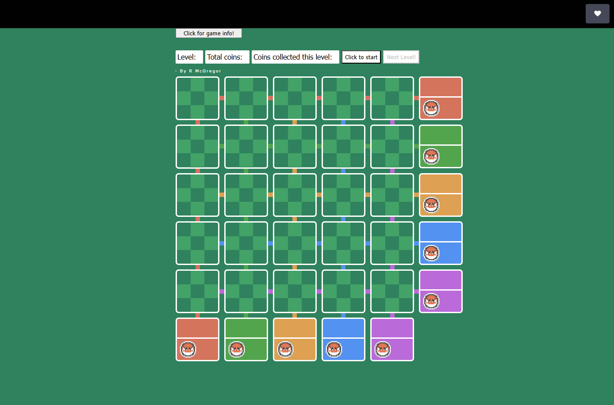

# Voltorb-Flip-TS

My version of the Pokemon game "Voltorb flip"

This project was an old one that i have since gone back to in the hopes of improving the code practices and logic.

There are still a few things i would like to improve on, such as:

 - An ability to make notes in the corner of the boxes, like in Sudoku. I intend on having an overlay on each box to allow the user to highlight which note(s) they would like to make.
 - Changing the background dynamically on clicks and being able to reset them again (NOW COMPLETE)

For a quick look at the game in action, follow the below link to my Code Sandox version of the game:

https://6zdfyh-1234.csb.app/

Alternatively, you can use this CodePen link for the same version of the game:

https://codepen.io/BobbyArmac/full/pomWmKO 

